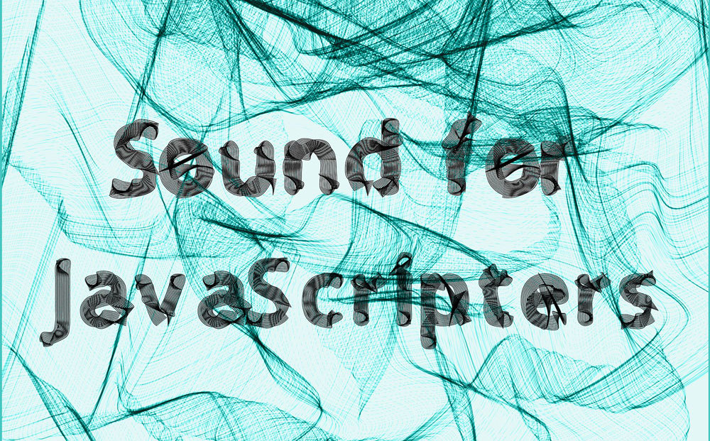

# 本書の対象読者及び目的

### 本書で作成したシンセサイザーを使ったポップス



本書で作成したシンセサイザーを使った歌物ポップスです。是非聞いてください。歌詞は JavaScript をイメージして作りました。

### いいテキストだと感じたら

以下のリンクから今後の開発費用をください。いくらでも OK です。



### 対象及び目的

本書は、JavaScript を書いた経験のあるユーザー向けのもので、ウェブブラウザ上で動くシンセサイザーを作る本です。このシンセは UI を持たず、MIDI キーボードを接続することで演奏を可能にします。

### 対象ブラウザ

ブラウザの対象は Chrome のみです。

### 必要な JavaScript の経験について

JavaScript の経験のレベルとしては、ある程度 ES2015+ のシンタックスに慣れていることを想定していますが、ES2015+ の実用的な書き方に慣れていない人にとっても有益な本であると思います。なぜなら `async / await` , `array.from()` , HOF = High Order Function といったモダンな書き方を積極的に取り入れているからです。

### テスト駆動開発の導入にも

Codesandbox のテスト実行環境を使って開発を進めていきますので、まだテストを書いたことがない人にもオススメです。

