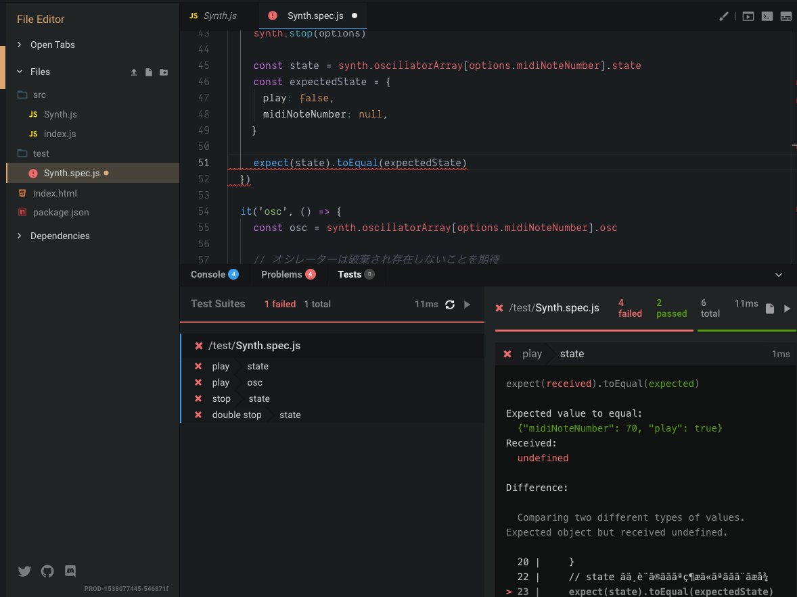

# テスト駆動開発

### テスト駆動開発

Codesandbox には、Jest によるテストを実行する機能があります。これを使ってテスト駆動開発をしていきます。テスト駆動開発とは、テストを先に書いて、その期待する挙動になるように、実装をしていくという手法です。当然ですが、テストを書いた時点ではほぼ全てのテストがエラーになります。最終的にテストが通れば、機能が完成しているということです。

#### fileName.spec.js というファイル名のものがテストされる

fileName.spec.js というファイル名にすると、自動的にそのなかのテストが実行されます。

そして実行結果は、Codesandbox  の test タブで見ることができます。以下の画像では、Synth.spec.js のテストをおこなった結果、6個中4個のテストが通らなかったことがわかります。本来出ればこの時点で全てのテストが失敗していないといけないのですが、今回は簡易的なテストなので許容することにします。



### 今回のテスト

次のコードが今回実際に使用するテストコードの概要です。\(開発しながらテストは少しずつ複雑にしていきますが、全体像がわかる概念としては\)

[https://codesandbox.io/s/27660xnm0](https://codesandbox.io/s/27660xnm0)

ポイントは、`synth.oscillatorArray` の中に、state と osc というプロパティを持つオブジェクトが配置され、state に現在の演奏状態が、osc に実際に音を出している oscillatorNode が配置される点です。この二つのプロパティの中身が期待しているようになっているかをテストしています。

```javascript
import Synth from '/src/Synth'

const synth = new Synth()

// 再生時に期待する動き
describe('play', () => {
  const options = {
    midiNoteNumber: 70,
  }

  it('state', () => {
    // midiNoteNumber 70 で再生する
    synth.play(options)

    // state には今の状態が記録されている
    const state = synth.oscillatorArray[options.midiNoteNumber].state
    const expectedState = {
      play: true,
      midiNoteNumber: 70,
    }

    // state が上記のような状態になることを期待
    expect(state).toEqual(expectedState)
  })

  it('osc', () => {
    // 実際のオシレーターノードが保存されている場所
    const osc = synth.oscillatorArray[options.midiNoteNumber].osc

    // オシレーターノードが、存在することを期待
    expect(!!osc).toBe(true)
  })
})

// 停止時に期待する動き
describe('stop', () => {
  const options = {
    midiNoteNumber: 70,
  }

  it('state', () => {
    // midiNoteNumber 70 を停止する
    synth.stop(options)

    const state = synth.oscillatorArray[options.midiNoteNumber].state
    const expectedState = {
      play: false,
      midiNoteNumber: null,
    }

    expect(state).toEqual(expectedState)
  })

  it('osc', () => {
    const osc = synth.oscillatorArray[options.midiNoteNumber].osc

    // オシレーターは破棄され存在しないことを期待
    expect(!!osc).toBe(false)
  })
})

// すでに停止している音を停止させる時の挙動
describe('double stop', () => {
  const options = {
    midiNoteNumber: 70,
  }

  it('state', () => {
    // midiNoteNumber 70 を停止する
    synth.stop(options)

    const state = synth.oscillatorArray[options.midiNoteNumber].state
    const expectedState = {
      play: false,
      midiNoteNumber: null,
    }

    expect(state).toEqual(expectedState)
  })

  it('osc', () => {
    const osc = synth.oscillatorArray[options.midiNoteNumber].osc

    // オシレーターは破棄され存在しないことを期待
    expect(!!osc).toBe(false)
  })
})

```


