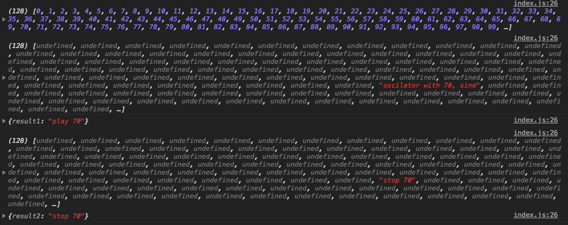

# Synth Class の設計図

Web Audio API の基本的な使い方がわかりましたので、ここからは本格的にシンセサイザーを作っていきます。まずは、鍵盤部分や MIDI Keyboard の入力の処理等を除いた、純粋に音を鳴らす目的だけを達成するための Synth Class を作ります。

### Synth Class の全体図

Synth Class から生成されたインスタンスには、play と stop というメソッドがあり、このメソッドに対して、MIDI Note Number を渡すことで、音がなったり、停止したりします。

次のコードはイメージです。

[https://codesandbox.io/s/k3y2wox22r](https://codesandbox.io/s/k3y2wox22r)



```javascript
import Synth from '/src/Synth'

// インスタンスを作成する際に波形の種類、設定などを渡す
const settings = 'someSettings'
const synth = new Synth(settings)

const options1 = {
  midiNoteNumber: 70,
}
// .play に midiNote を渡すと再生する
const result1 = synth.play(options1)

console.log({ result1 })

const options2 = {
  midiNoteNumber: 70,
}
// .stop に midiNote を渡すと停止する
const result2 = synth.stop(options2)

console.log({ result2 })

```





```javascript
class Synth {
  constructor(settings) {
    // 各種設定を持つ
    // 波形等々
    this.settings = settings
  }

  // midiNoteNumber を受け取って再生する
  play({ midiNoteNumber }) {
    return `play ${midiNoteNumber}`
  }

  // midiNoteNumber を受け取って停止する
  stop({ midiNoteNumber }) {
    return `stop ${midiNoteNumber}`
  }
}

export default Synth

```



### .play\(\), .stop\(\) 設計図

具体的に `synth.play()` , `synth.stop()` メソッドについて考えていきます。

[https://codesandbox.io/s/yv85wnvyjv](https://codesandbox.io/s/yv85wnvyjv)

ポイントは `this.oscillatorArray` の存在です。この配列は、最初は 128 の長さを持つ、中身が空の配列ですが、オシレータが再生された際には、対応する index へとオシレーターが保存されます。例えば MIDI Note Number 70 をオシレーターが再生された場合には、そのオシレーターは `this.oscillatorArray[70]` の中に保存されます。そして、MIDI Note Number 70 を停止する場合には、 `this.oscillatorArray[70]` に入っているオシレーターに `.stop()` すれば良いわけです。

また、再生中ではないオシレーターを止めようとした場合には、特に何もしません。再生中かどうかは、配列にオシレーターが存在するか存在しないかで判定します。



```javascript
class Synth {
  constructor(settings) {
    this.settings = settings
    this.destination = 'destination'
    // この配列に再生中のオシレーターが、
    // index = midiNoteNumber の場所に保存される
    // midiNote 60 を再生するオシレーターは
    // this.oscillatorArray[60] に保存される
    this.oscillatorArray = Array.from({ length: 128 })

    // this.oscillatorArray が何個あるか確認
    console.log(this.oscillatorArray.map((o, index) => index))
  }

  // midiNoteNumber からその周波数を再生する
  // オシレーターを作成する
  createOscillator({ midiNoteNumber, wave }) {
    return `oscilator with ${midiNoteNumber}, ${wave}`
  }

  // midiNoteNumber を受け取って再生する
  play({ midiNoteNumber }) {
    const wave = 'sine'
    const oscillator = this.createOscillator({ midiNoteNumber, wave })
    // connect と play をする
    // oscillator.connect(this.destination)
    // oscillator.play()

    // oscillator を配列に保存する
    this.oscillatorArray[midiNoteNumber] = oscillator
    // 中身確認
    console.log(this.oscillatorArray)
    return `play ${midiNoteNumber}`
  }

  // midiNoteNumber を受け取って停止する
  stop({ midiNoteNumber }) {
    // midiNoteNumber に対応する index に
    // 再生中のオシレーターがあるか確認する
    const targetOscillator = this.oscillatorArray[midiNoteNumber]
    if (!targetOscillator) {
      // ないときは停止すべき対象がないので
      // 特に何もしない
      return `not ${midiNoteNumber} playing`
    }

    // 対象がある場合は止める
    //targetOscillator.stop()

    // 本来であれば、止めるだけで配列が空になるが、
    // ダミーのコードなので、そこに目印を入れることにする
    this.oscillatorArray[midiNoteNumber] = `stop ${midiNoteNumber}`
    // 中身確認
    console.log(this.oscillatorArray)
    return `stop ${midiNoteNumber}`
  }
}

export default Synth

```





```javascript
import Synth from '/src/Synth'

// インスタンスを作成する際に波形の種類、設定などを渡す
const settings = 'someSettings'
const synth = new Synth(settings)

const options1 = {
  midiNoteNumber: 70,
}
// .play に midiNote を渡すと再生する
const result1 = synth.play(options1)

console.log({ result1 })

const options2 = {
  midiNoteNumber: 70,
}
// .stop に midiNote を渡すと停止する
const result2 = synth.stop(options2)

console.log({ result2 })

const options3 = {
  midiNoteNumber: 100,
}
// .stop に再生していない midiNote を渡すと
// 特に何もしない
const result3 = synth.stop(options3)

console.log({ result2 })
```



### 設計図まとめ

以下の画像は上記コードの実行時のコンソール画面の内容ですが、次のことがわかります。\(CodeSandbox 側ではなく Chrome でご確認ください\)

* `this.oscillatorArray` は index: 0~127, length: 128 の空の配列
* `synth.play({midiNoteNumber: 70})` をすると、 再生中のオシレータが、対応する index に保存される
* `synth.stop({midiNoteNumber: 70})` をすると、 対応する index に保存されている再生中のオシレーターを停止させる。



では次の章から実装していきましょう。

