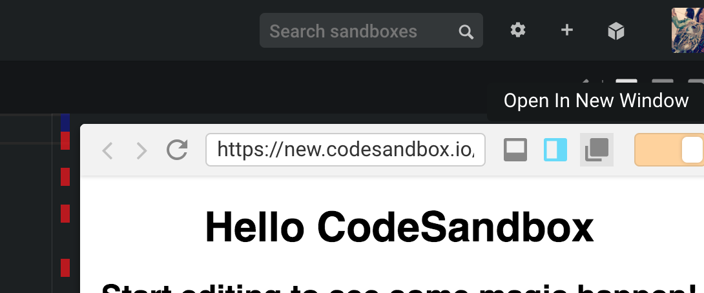

# Web MIDI API を使用して MIDI キーボードにアクセス

Web MIDI API を使うと、ブラウザから、現在 Mac / PC に接続されている MIDI デバイスにアクセスすることができます。さらにそのデバイスから MIDI メッセージを受け取った際に、どんなことをするかというハンドラを定義することができます。

これを使って、MIDI キーボードから MIDI メッセージが送られて来た時に、ここまでで作った synth インスタンスへ値を送って演奏すればいいわけです。

**注意してほしいポイント**が一つあって、Codesandbox の**エディター画面**からは Web MIDI API を実行するとエラーが出てしまいます。`Open In New Window` を押して全画面モードにしてください。そこでは正常に Web MIDI API を実行することができます。



以下のソースが完成系です。\(`getMIDIInputDevices` と `getMIDIMessage` はこれから作っていきます。\) 流れとしては以下のようになります。 

* synth インスタンスを作成する。
* `getMIDIInputDevices` でブラウザから、Mac / PC に接続されている MIDI デバイスを全て取得する。
* MIDI デバイスが MIDI メッセージを受け取った際に実行するハンドラを定義する\(`o.onmidimessage = getMIDIMessage(synth))`\)
* `getMIDIMessage(synth)` は高階関数、つまり関数を返す関数になっている。引数として synth インスタンスを渡すことで、そのシンセを実行するハンドラを登録できる。



```javascript
import Synth from '/src/Synth'
import createAudioContext from '/src/WebAudioAPI/createAudioContext'
import getMIDIInputDevices from '/src/MIDI/getMIDIInputDevices'
import getMIDIMessage from '/src/MIDI/getMIDIMessage'

const audioContext = createAudioContext()
const destination = audioContext.destination

// synth インスタンスを作成
const synth = new Synth({
  audioContext,
  nextNode: destination,
})

// MIDI device にアクセスして、
// MIDI message を受け取った際に起動させるハンドラを登録する
const start = async () => {
  // MIDI デバイスを取得する
  const MidiInputDevices = await getMIDIInputDevices()
  console.log({ MidiInputDevices })
  if (MidiInputDevices) {
    // 全ての MIDI デバイスへ
    // MIDI メッセージを受け取った際に起動するハンドラを付与する
    // getMIDIMessage がハンドラ
    // ハンドラで使用する synth インスタンスを渡す
    MidiInputDevices.forEach(o => (o.onmidimessage = getMIDIMessage(synth)))
  }
}

start()

```



### getMIDIInputDevices

[https://codesandbox.io/s/km42r386r5?module=%2Fsrc%2FMIDI%2FgetMIDIInputDevices.js](https://codesandbox.io/s/km42r386r5?module=%2Fsrc%2FMIDI%2FgetMIDIInputDevices.js)



```javascript
const getMIDIInputDevices = async () => {
  try {
    // MIDI デバイスにアクセスする
    const access = await navigator.requestMIDIAccess({
      sysex: false,
    })
    // acess.inputs(と outputs).values にデバイス一覧があるが
    // イテレータオブジェクトなので扱いにくい
    // そこで array に変換する
    const MidiInputDevices = Array.from(access.inputs.values())
    const MidiOutputDevice = Array.from(access.outputs.values())

    console.log(
      'midiIn and midiOut devices',
      MidiInputDevices,
      MidiOutputDevice
    )

    // 今回は inputs しか使わないので、これを返す
    return MidiInputDevices
  } catch (error) {
    console.error('[ERROR] requestMIDIAccess()', error)

    return false
  }
}

export default getMIDIInputDevices

```



コードはシンプルで、MIDI デバイスにアクセスして input 用の部分だけを取り出して返す関数です。ポイントは以下です。

* async / await を使用して`requestMIDIAccess` をしている。このメソッドは promise ベースで動いているので async / await を使って可動性をあげました。こちらの方がいいでしょう。
* access.inputs.values\(\) と access.outputs.values\(\) の値はイテーレーターオブジェクトで、扱いが面倒なので `Array.from()` を使って配列に変換しています。
* 最後に MidiInputDevices を返します。これは今アクセスできる MIDI デバイスを扱うためのものが全て入った配列です。

さて次は、返した MidiInputDevices を使って、MIDI メッセージを受け取った時の処理を追加します。

